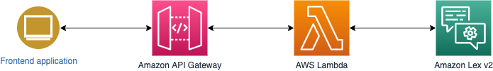

# Serverless Bot for Amazon Lex
This is a sample implementation of a serverless chatbot that works with Amazon Lex V2. 
[Here](https://github.com/aws-samples/aws-lex-web-ui) is another sample implementation for the Lex, which talks with Amazon Lex directly. Difference is that this sample talks with Amazon Lex through Amazon API Gateway and AWS Lambda function.
Please see below diagram to understand the architecture.



## Deploy
Before deploying, you should create a chatbot using Lex V2. You need the Bot ID, the Bot Alias ID, and the Bot Locale.

Please go to `backend` directory.
```sh
cd backend
```

Please install dependencies for CDK using npm.
```sh
npm ci
```

Now you can deploy the stack with parameters for BotID, Bot Alias ID, and Bot Locale. for the Bot Locale, please specify like 'ja_JP'.
```sh
npm run cdk -- deploy BotStack --parameters BotId=<BotID> --parameters BotAliasId=<BotAliasId> --parameters BotLocale=<Locale>
```

If things go successfully, you will see an output about API endpoint. please copy this and keep it in your text editor as we will use it in the next step.
```sh
Outputs:
BotStack.RestApiEndpointXXXXXX = https://XYXYXYXY.execute-api.ap-northeast-1.amazonaws.com/api/
```

After deployment complete, Please move to the `frontend` directory.

```sh
cd ../frontend
```

Please install dependencies for frontend application using npm.
```sh
npm ci
```

Please edit `.env` file so that it has the correct API endpoint.
```sh
VUE_APP_API_BASE_URL="https://XYXYXYXY.execute-api.ap-northeast-1.amazonaws.com/api"
# please note that we do not need the trailing slash.
```

Now you can run the frontend application locally.
```sh
npm run serve
```

Please launch your browser and access to localhost:8080.


## Security
See [CONTRIBUTING](CONTRIBUTING.md#security-issue-notifications) for more information.


## License
This library is licensed under the MIT-0 License. See the LICENSE file.